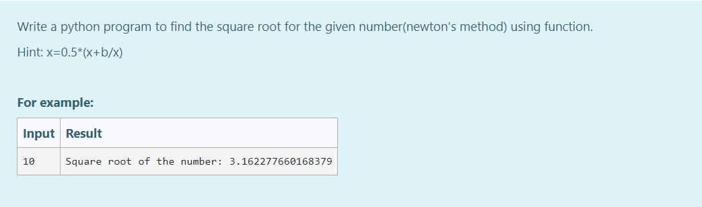

# Find the square root of a number
NAME : ALIYA SHEEMA

REFERENCE NUMBER : 23005529

DEPARTMENT : AIDS
## AIM :
To write a program to find the square root of a number.

## EQUIPEMENTS REQUIRED :
1. Hardware – PCs
2. Anaconda – Python 3.7 Installation / Moodle-Code Runner

## ALGORITHM :
1. Define a function.
2. Assign number_iters = 100 in the function to perform 100 iteratios.
3. Set i = 0.
4. Calculate  number = 0.5 * (number + a / number) for 100 iterations.
5. Return number

## PROGRAM :
```
Program to find the square root for the given number(newton's method) using function.
Developed by: ALIYA SHEEMA
RegisterNumber:  23005529

def sqroot():
    a=int(input())
    b=int(a)
    for i in range(100):
        a=0.5*(a+b/a)
    print("Square root of the number:",a)
sqroot()
```

## OUTPUT :




## Result:
Thus the program to find the square root for the given number(newton's method) using function is written and verified using python programming.
